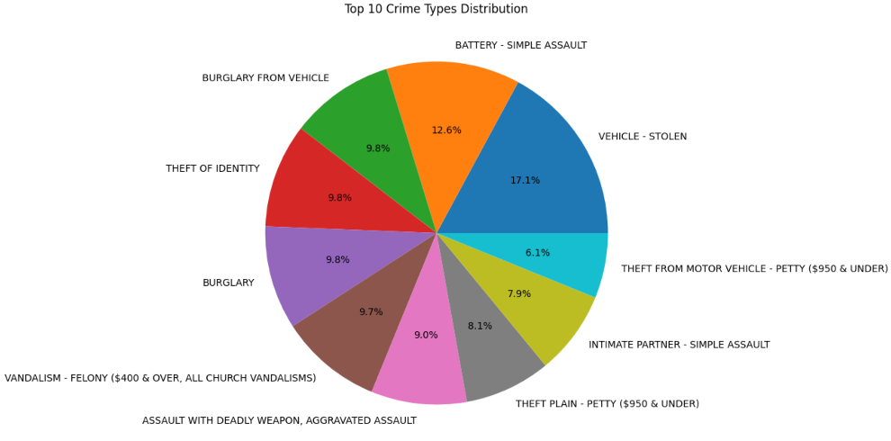
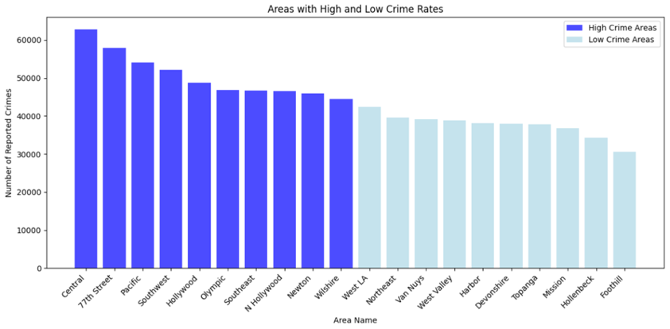
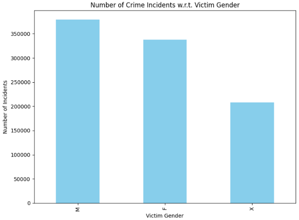
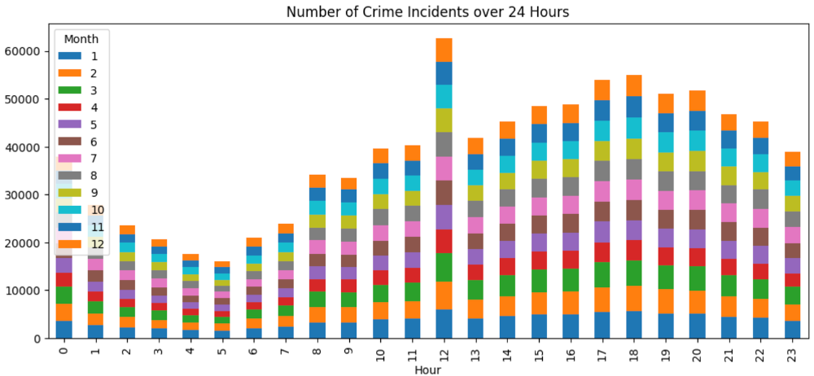
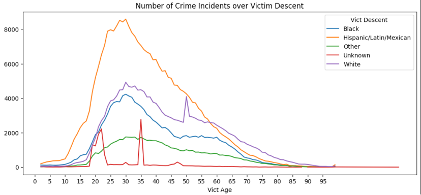
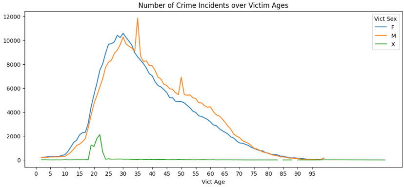
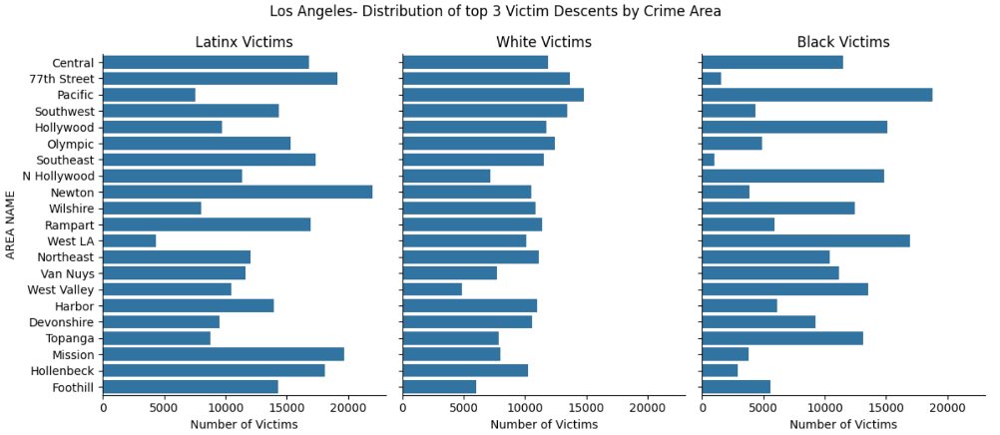

# Crime Rate Prediction Model for Los Angeles

The project aims to develop a predictive model for crime rates in Los Angeles to enhance public safety measures and resource allocation. Given the dynamic nature of crime patterns, precise forecasting can help law enforcement agencies to preemptively address potential hotspots.

## Objective

The primary objective is to accurately forecast crime occurrences across Los Angeles using historical crime data.

## Data Source

- [Crime Data from 2020 to Present](https://catalog.data.gov/dataset/crime-data-from-2020-to-present)

## Data Preparation

### Preprocessing Steps

- Data cleaning involved handling missing values, removing duplicates, and converting data types.
- Date and time entries were standardized, and geographical data were verified for accuracy.
- Features like day of the week, month, and hour of the day were engineered from date-time information.

## Exploratory Data Analysis (EDA)

1. **Top 10 Crime Distribution.**

   Most of the crimes were related to theft, burglary, and violent offenses, with vehicle theft being the most common.

   

2. **Top Areas with higher and lower crime rate.**

   I have found that top 5 area which has higher crime rates are central, 77th Street, pacific, southwest, and Hollywood.

   

3.	**Number of Crime Incidents w.r.t Victims gender.**

   Not much difference between the victims’ gender and can’t say anything on unknown gender so, can’t say which gender is most affected.

   

4.	**Number of crime incidents over 12 months.**

   [Crime Distribution](Images/crimeovermonth.png)
   
6.	**Is there any pattern of the number of crime incidents over the hour?**

   Yes, the number of crime incidents is the highest at noon (the lunch time). The second peak is around the dinner time.

   

6.	**Analysis of 'Age':**

  	It shows the number of the top five descents over ages. There are two exceptional peaks: age 50 for White and age 35 for Unknown. (More explanations are waiting for experts whp    know more about crimes)

   

   

   As for the numbers of different genders over ages, two observations:
   There is a separating line at age 35. Below this age, the number of crime incidents against female is higher than that of male. There are two exceptional peaks for male: age 35    and 50. There is a gender code 'H' (82 crime incidents), which is not mentioned in the official website.

7.	**Distribution of top 3 Victim Descents by Crime Area.**

   

   Looking at the top 3 vulnerable demographics in LA, Latinx, White and Black communities has most suffered in the highest crime occurring areas of Central, 77th Street and          Pacific. This could also be that there are lesser White people living in these two areas. White victims are highest in the 77th street, Pacific areas. Again, this could be         because these areas have higher white population. Similarly, areas such as 77th street, Mission, Newton, Rampart, Foothill and Hollenbeck have a higher number of Latinx victims    than the other descents.

##SARIMAX Model Implementation
Implemented SARIMAX models with grid search to optimize performance. The model (1, 0, 2)x(2, 0, [1], 12) fit a crime count dataset (January 2020 to July 2022) with AIC: 520.602 and BIC: 530.640. Coefficients for AR and MA parts suggest influences on predictions, with non-significant seasonal components possibly requiring simplification.

###Performance Analysis
Evaluated using RMSE, the final value of 656.30 shows improvement over baselines but indicates room for enhancement. Future steps include gathering more data and ongoing evaluation for stronger predictions.

